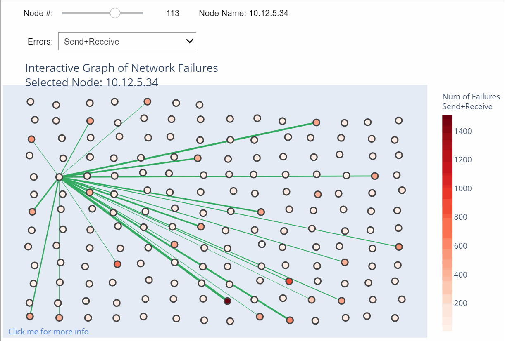
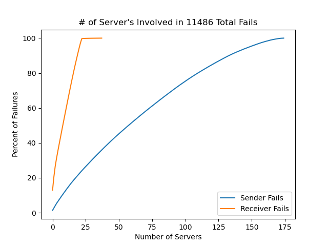

## Project Name & Summary
*Network Server Error Log Visualizer.*  

Routines to interactively visualize network server error log files
to graphically determine which servers tend to fail and to potentially
find relations between failing connections.

## Table of contents
* [Project Description](#project-description)
* [Getting Started](#getting-started)
* [Prerequisites](#prerequisites)
* [Usage](#usage)
* [Screenshots](#screenshots)
* [License](#license)
* [Contact](#contact)

## Project Description
Based on server log files listing send and receive errors between nodes on a cluster,
data visualization routines were created to interactively determine the count and type
of failures between servers.

The user can interact with the figure through dropdown menus or sliders, or simply click on a node
in the graphic to see send, receive, or send and receive errors between that node and others.

Each node's color indicates the total number of errors for that node. 
The width of the line connecting the nodes is proportional to the number of errors between servers.  

The user can hover over nodes to display pop-up labeling 
with additional descriptive statistics about send/receive errors.

Additional text information listing the top 25 servers for send/receive errors are also displayed.

## Getting Started

### Prerequisites

The following packages are required:  
* pandas
* numpy
* matplotlib.pyplot
* plotly
* networkx
* ipaddress
* ipywidgets
* jupyter (if you wish to use the interactive figure widgets)

## Usage

Open and run `main_jupyter_v01.ipynb` in a jupyter notebook to explore interactive plotting features.

If you do not have jupyter, you can run `python main_pycharm_v01.py` to create static html versions 
of key plots.  Note: these will not be interactive if outside the jupyter environment.

## Screenshots
Interactive figure on jupyter to explore server errors. 
Use the slider, dropdown menu, or simply click on a node to update the figure.  

Cumulative error plot to quickly determine the number of problematic servers on the system.

## License

Distributed under the *** License. See `*** License Info ***` for more information.

## Contact

Tony Held - tony.held@gmail.com  
Project Link: [https://github.com/TonySoloProjects/network_log_visualization](https://github.com/TonySoloProjects/network_log_visualization)
